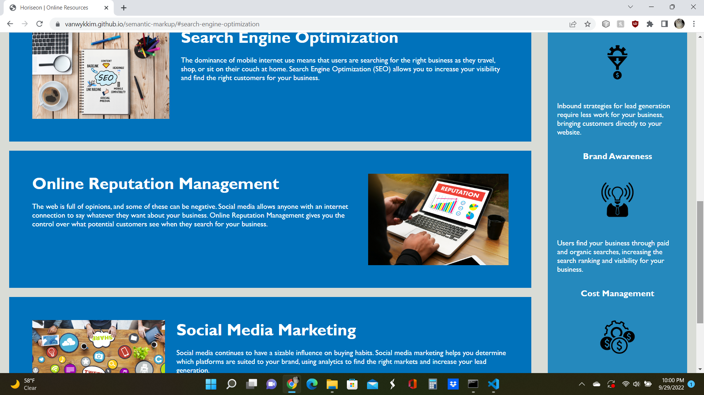

# semantic-markup - Challenge 1
---

## Description

Make the HTML/CSS code in a webpage more readable/semantic:

- Added id-tag to line 30 to make href work
- Changed all Div tags to be more semantic and describe their purpose better to make code more accessible
- created a read.me
- DRY - combined similar code in benefit classes into 1 benefit-item

## Screenshot

## Link to Project

[https://vanwykkim.github.io/semantic-markup/]

## Credits

UW bootcamp starter code

## License

Please refer to the LICENSE in the repo.

